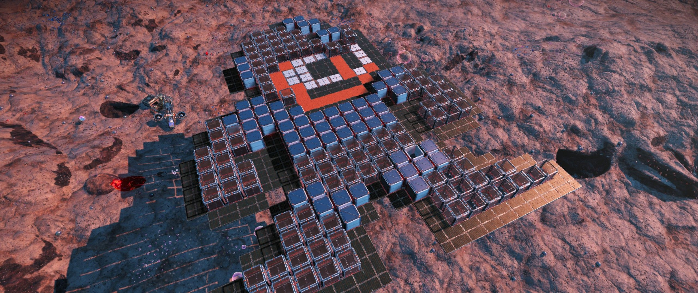

# nms-gen



## Overview 

`nms-gen` is a cli tool used to insert pixel art into a No Man's Sky save file as base parts/geometry. In a nutshell, one can take a sprite and insert it into a base as a series of objects that look like the original sprite. The process is not 100% fully automated; some manual import/export operations with the NMS Save Editor are required at the moment.

The process looks like this:

1. Export the base data as JSON using NMS save editor.
2. Run `nms-gen` with the correct inputs to update the save data (see example use for how to do this).
3. Import the updated base data using NMS save editor.

Note: Because there is potential to inadvertently corrupt save data, it's highly important that one *make a back-up of the existing save data before trying to manipulate the data*.

## Importing and Exporting Data

The [No Man's Sky Save Editor](https://github.com/goatfungus/NMSSaveEditor) provides capabilities for importing and exporting base data in JSON format. The process is somewhat intuitive if you take some time to learn about the editor.

## Example nms-gen Use

Assuming one has cloned the source and set things up with `uv`, the process of updating the base data from a sprite is a one-liner command like the following:

`uv run main.py input_bases/bubble_base.json sprites/mega_man_standing.png 40 --o my_output_file.json`

### Command Break-down

In this example `input_bases/bubble_base.json` is the original JSON base data, exported from NMS Save Editor.

`sprites/mega_man_standing.png` is the input sprite to inject into the base data.

The `40` is a z-up value to elevate the base geometry so that it doesn't get stuck in the terrain. You may need to experiment with this depending on the terrain around your base.

`--o my_output_file.json` is how you specify the updated save data output file.

If your pixel data import is successful, you'll see something like this in the console:

```
Success!
```


